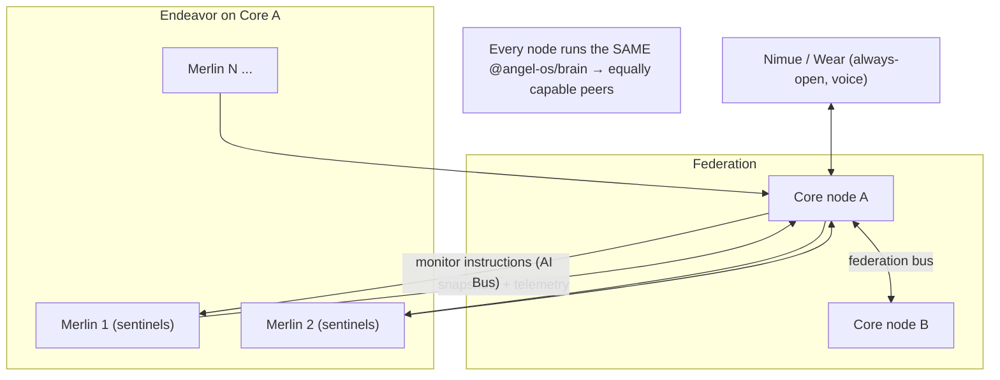
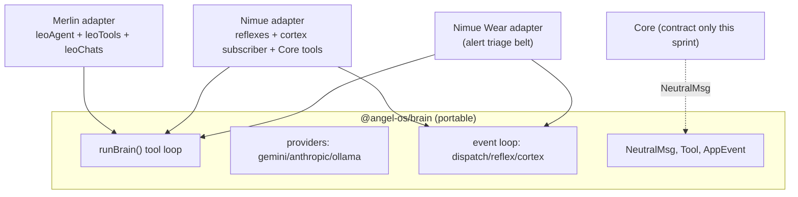
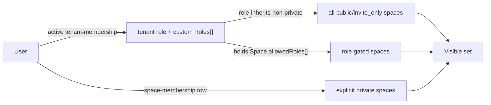
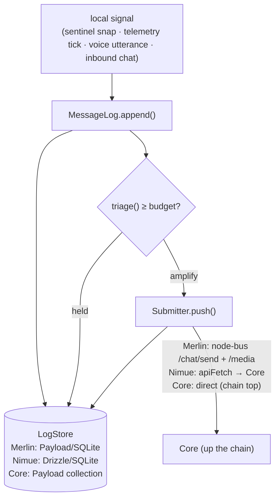
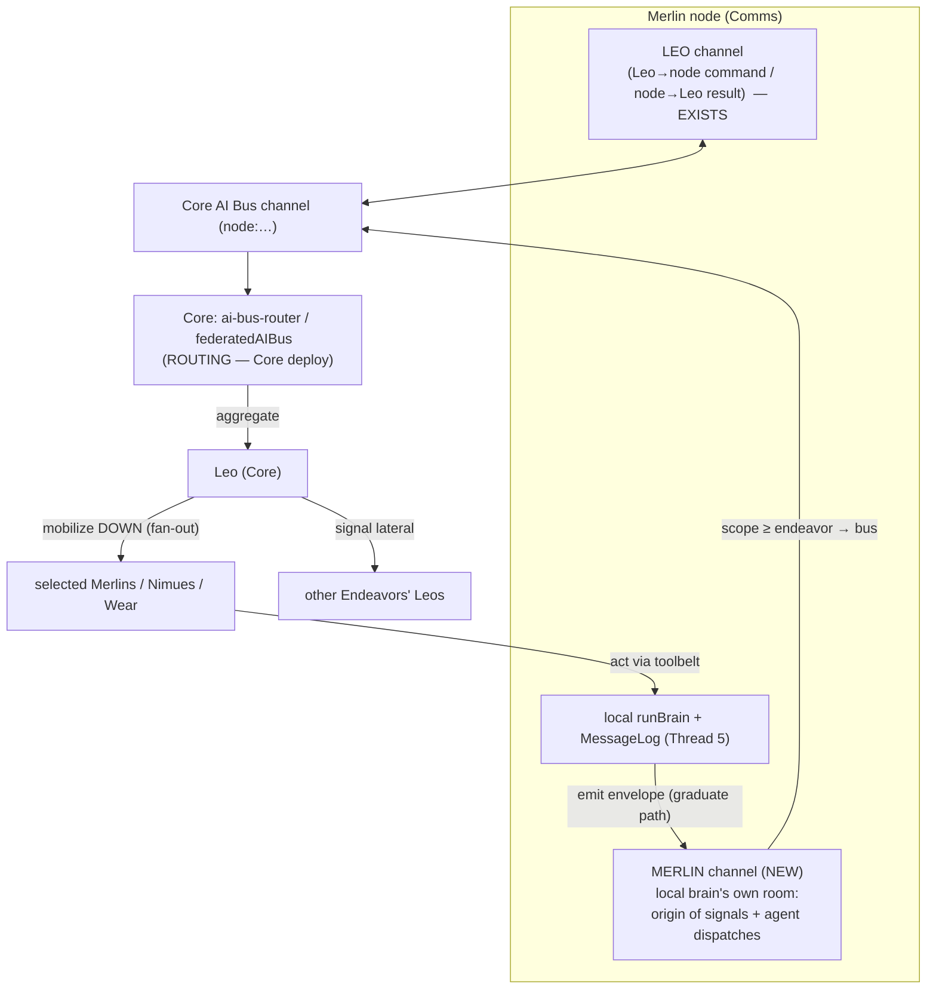
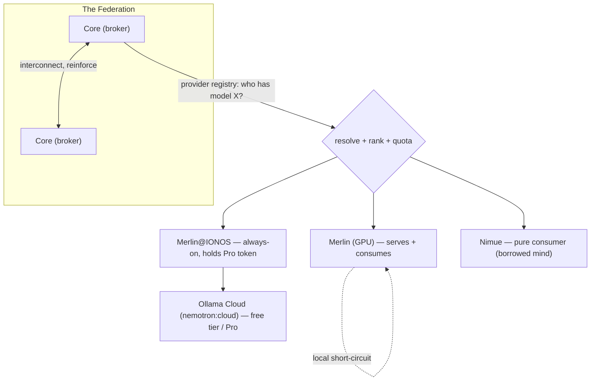

# 260626 Cursor Development Plan — Shared Brain, Role-Based ACL, Site Duplication

> Three-body dev (Core `C:\Dev\angels-os` · Merlin `C:\Dev\merlin` · Nimue `C:\Dev\nimue`), authored in Cursor (Opus 4.8) after the Claude Code Max lapse. Cursor edits all three repos in one session via absolute paths — the three-body workflow is preserved.

This plan covers the three threads selected for this sprint:

1. **The shared modular "brain"** — extract a portable package (`@angel-os/brain`) that drops into Merlin, Nimue, Nimue Wear, and Core.
2. **Role-based ACL ("groups")** — stop hand-editing per-space permissions; observe roles we already have, and allow adding custom roles.
3. **Site duplication / rebrand** — a new option on `/dashboard/admin/provision` that clones the current site under a new brand.

Everything else from the handoffs (Merlin sentinel/installer, Nimue voice mic fix, Nimue GPS telemetry, Wear app, shadcn Media table) is captured as **Phase-later backlog** at the bottom, not built now.

---

## The vision this serves — a distributed network of equally-capable agents

The end state: **hundreds of Merlins**, each running sentinels, beaming up **hundreds of snapshots per hour**, each ingested and **optionally analyzed**. Merlins are remotely **configurable from Core** — told what to monitor (cameras, windows, screens, folders, anything). Core already communicates with the whole **federation**, and the goal is a **distributed network of agents that all react and eventually communicate with each other** — every node **equally super-smart/capable** (the shared Brain is what makes them peers, not a hub-and-spoke with dumb edges).



### How today's code maps to the vision (grounded)

- **Configure-from-Core / monitor anything:** the AI Bus carries `node-command`s to Merlin; Merlin's `sentinel`/`snap`/`camera` skills already accept remote start/stop/config ([`merlin/src/app/api/node/sentinel`](C:\Dev\merlin\src\app\api\node\sentinel\route.ts), `node/snap`). The belt of "what to monitor" grows from here.
- **Ingest exists** — every snapshot POSTs to `nodeMediaHandler` ([`src/endpoints/node-ops.ts`](C:\Dev\angels-os\src\endpoints\node-ops.ts)), which creates a Media doc + records a submittal.
- **"Optionally analyzed" is accurate** — the ingest path does NOT auto-analyze; analysis is a separate opt-in (`/api/media/analyze` → MediaMeta). At scale this becomes a **queue/triage decision**: the shared `triage.ts` is exactly the gate that decides which of the hundreds of shots/hour are worth a (paid) vision-model pass.
- **Federation comms exist** — `federatedAIBus.ts`, `ai-bus-router.ts`, `federation-*` endpoints already bridge nodes; "agents communicate with each other" extends this.

### Scale realities to design for (flagged now, not solved this sprint)

- **Submittal hotspot:** `nodeMediaHandler` records each snapshot via read-modify-write of ONE JSON settings blob per endeavor (`merlin-node-submittals`, capped 200). At hundreds of nodes × hundreds/hour this is write contention + lost history → migrate to a real indexed collection (Submittals) before high volume.
- **Ingest cost:** unbounded Media doc creation + blob storage. Needs retention policy + the triage gate to throttle analysis (never auto-analyze everything).
- **Peer-equal capability** is delivered by the shared Brain (Thread 1) — that's the architectural keystone that makes "all equally super smart" true rather than aspirational.

## Guardrails (respect existing laws)

- **Never** modify `next.config.js` in any repo (explicit user rule). Avoid config-file edits unless adding a genuinely new variable.
- **0 filesystem artifacts in release** — Core content via Payload/blob storage.
- **Pony Tail / Answer53** — one source of truth per concern; no duplicate registries.
- **An LLM is never the authorization oracle** — ACL stays in the pure `PermissionService` resolver.
- **Pre-push gate (Core):** `npx tsc --noEmit -p tsconfig.json 2>&1 | grep -E "^src/"` (FULL `src/`).

---

## Thread 1 — The shared "brain" package

### What exists today (grounded)

- **Merlin already holds the portable engine.** [`C:\Dev\merlin\src\lib\leoBrain.ts`](C:\Dev\merlin\src\lib\leoBrain.ts) is a pure `(messages, tools, providerConfig) → reply` tool loop (max 6 steps) that imports **nothing platform-specific** — the tool belt and provider keys are injected. Its docstring literally says "Drop this same file into Core or Nimue."
- The interop contract is the **neutral message format** in [`C:\Dev\merlin\src\lib\leoProviders.ts`](C:\Dev\merlin\src\lib\leoProviders.ts) (`NeutralMsg`, `Tool`, `ToolResult`) with adapters for Gemini / Anthropic / Ollama and a cloud-first → Ollama-fallback `resolveProvider`.
- The **Merlin adapter** [`C:\Dev\merlin\src\lib\leoAgent.ts`](C:\Dev\merlin\src\lib\leoAgent.ts) injects `TOOLS` ([`leoTools.ts`](C:\Dev\merlin\src\lib\leoTools.ts)) + keys + persistence ([`leoChats.ts`](C:\Dev\merlin\src\lib\leoChats.ts)) and calls `runBrain`.
- **Nimue has the Event Loop spine but NO cortex/brain.** [`C:\Dev\nimue\src\lib\events.ts`](C:\Dev\nimue\src\lib\events.ts) implements `dispatch()` → persist → synchronous reflexes (cerebellum). The cortex (model subscriber) is explicitly "NOT wired in slice 1." One reflex exists ([`reflexes.ts`](C:\Dev\nimue\src\lib\reflexes.ts)).
- **Core's brain is separate and huge** — `leo-data-tools.ts` (141 tools) + `leo-stream.ts`. Core is NOT a consumer of the package in this sprint (its tool loop is mature); it only contributes the canonical `NeutralMsg` shape going forward.

### North star — the Brain is a constantly-running functional loop for real-time control

The endgame for `brain.ts` + the Event Loop is not a chat box — it is a **continuously-running brain** for eventual **external robotic control**: real-time events stream in, the loop triages, the cortex acts. Embodiment-specific intent:

- **Nimue + Wear:** meant to be **left open** with an **interactive voice conversation** running against the live loop (always-on perception + voice in/out). These are the "always awake" bodies. The cortex wake + triage gate exist precisely so an always-open loop doesn't burn the model budget on noise.
- **Merlin:** NOT a conversational always-on body. It **sits on a machine and monitors everything** — the eyes/ears + a **distributed file repository** of The Angel OS (a modern Gnutella/eDonkey-style sharing mesh), surfacing the files people choose to share, proxying the **local Ollama** and other shareable resources up to the federation. Its loop is a monitor/ingest/serve loop, not a voice loop.

The shared package serves all three; only the injected belt + which subscribers are installed differ per body.

### Decision: a real shared package (user chose "package")

Create a new sibling repo/package **`C:\Dev\angel-brain`** published as **`@angel-os/brain`**, consumed by Merlin, Nimue, and Nimue Wear. It is **runtime-agnostic** (no `fs`, no Capacitor, no Payload, no DOM) so it works in Node (Merlin), a Capacitor WebView (Nimue), and Wear.



### Package layout (`C:\Dev\angel-brain`)

- `package.json` — name `@angel-os/brain`, `type: module`, ESM build via `tsup`, zero runtime deps (provider HTTP via `fetch`). Peer-free.
- `src/brain.ts` — moved verbatim from Merlin `leoBrain.ts` (the engine).
- `src/providers.ts` — moved from Merlin `leoProviders.ts` (`NeutralMsg`, `Tool`, `callModel`, `resolveProvider`).
- `src/loop.ts` — generalized from Nimue `events.ts`: `dispatch`, `registerReflex`, `subscribe`, `appendEvent`, with a **pluggable storage interface** (`EventStore` = `{ get, set }`) so Nimue passes Capacitor Preferences, Merlin passes a JSON/file store, Wear passes its own. Adds the missing **cortex hook**: `registerCortex(predicate, handler)` — the rate-limited "should the brain wake?" subscriber described in [`C:\Dev\merlin\docs\EVENT_LOOP.md`](C:\Dev\merlin\docs\EVENT_LOOP.md).
- `src/triage.ts` — **new, shared**: the "battle computer" signal filter both bodies need ("only amplify clearly worthwhile signals"). A pure `triage(event, policy) → { amplify: boolean, score, reason }` with a tunable noise budget. This is the common abstraction the user described for Merlin (screen/camera deltas) and Nimue (telemetry/alerts).
- `src/index.ts` — barrel exports.
- `tsconfig.json`, `tsup.config.ts`, `README.md`, `vitest` for `brain`, `loop`, `triage`.

### Integration

- **Local linking, not npm publish (yet).** Use a file link so the bodies resolve `@angel-os/brain` from `C:\Dev\angel-brain` without a registry: add `"@angel-os/brain": "file:../angel-brain"` to Merlin and Nimue `package.json` and `pnpm install`. The package ships **pre-built ESM** (`tsup` → `dist/`), so Next bundles it with **no `next.config.js` change** — verified by a clean Nimue `pnpm build`.
- **CRITICAL — Core does NOT link the package.** Core deploys to Vercel, which clones only the `angels-os` repo; a `file:../angel-brain` path doesn't exist on the build machine and would break the (paid) deploy. Core shares only the `NeutralMsg` contract. If Core ever needs the package, publish to a registry or use a git dependency — a deliberate, separate step.

### Status — SHIPPED (local, no Core deploy)

- `C:\Dev\angel-brain` scaffolded: `brain.ts`, `providers.ts`, `loop.ts` (EventLoop with pluggable `EventStore` + `registerCortex`), `triage.ts`. **20 unit tests passing**; `dist/` built.
- **Merlin:** `leoBrain.ts` + `leoProviders.ts` converted to thin re-export shims from `@angel-os/brain`. `npx tsc --noEmit` clean; all LEO tests pass (the 10 failing Merlin tests are pre-existing `inventoryQueue`/`inventoryUploader` SQLite/geo tests, unrelated).
- **Nimue:** `events.ts` rewritten as an adapter over the package `EventLoop` (Capacitor `EventStore`), preserving the exact module API so all consumers are untouched. New `cortex.ts` = Nimue's brain-wake adapter (triage gate + small read-only Core-routed tool belt, suggest-don't-act). `pnpm typecheck` + `pnpm build` clean.
- **Merlin migration:** replace bodies of `leoBrain.ts` / `leoProviders.ts` with re-exports from `@angel-os/brain` (keep the files as thin shims so nothing else in Merlin breaks), or update imports in `leoAgent.ts`. Keep `leoTools.ts`/`leoChats.ts`/`leoAgent.ts` as Merlin's **adapter** (unchanged behavior).
- **Nimue migration:** swap `events.ts` internals to import `loop.ts` from the package (Nimue keeps a tiny `events.ts` shim that injects the Capacitor `EventStore`). Add Nimue's **first cortex subscriber + tool belt** (Core-routed tools via the existing [`payload-client.ts`](C:\Dev\nimue\src\lib\payload-client.ts) — e.g. `query_spaces`, `send_message`) so Nimue gets the same modular brain Merlin has. This is the "Brain upgrade Nimue has yet to receive."

### Acceptance

- `@angel-os/brain` builds + unit tests green in isolation.
- Merlin `runAgent` still works through the package (LEO tab on `/merlin?tab=leo` answers, tools fire) — no behavior change.
- Nimue can `dispatch()` an event and a cortex subscriber wakes the brain for a worthwhile signal only (triage gate observed), proven by a unit test + an in-app smoke on `/activity`.
- Core untouched (contract-only).

---

## Thread 2 — Role-based ACL ("groups" = roles) + custom roles

### What exists today (grounded — important)

The visibility model already does most of what's wanted. From [`C:\Dev\angels-os\src\services\PermissionService.ts`](C:\Dev\angels-os\src\services\PermissionService.ts) `resolveVisibleSpaceIds`:

- **role-inherits-non-private** — an **active** member of a tenant sees **ALL** that tenant's `public` + `invite_only` spaces **with no per-space membership row required**.
- **explicit-private-grants** — only `private` spaces need a `space-memberships` row.
- Platform admins / system users see everything.

So the "stop continually modifying space permissions" goal is **already the intended design** — provided spaces are NOT marked `private` and the user has an **active `tenant-membership`**. This is also why Junaid can't see Spaces: almost certainly **no active tenant-membership** for that portal (pending, or never created), OR spaces wrongly marked `private`.

Roles today are **hardcoded enums** in three places:
- Platform roles: [`Users/index.ts`](C:\Dev\angels-os\src\collections\Users\index.ts) `roles` — `super_admin | archangel | admin | producer | customer`.
- Tenant roles: [`TenantMemberships/index.ts`](C:\Dev\angels-os\src\collections\TenantMemberships\index.ts) `role` + a `permissions[]` grant list.
- Space roles: [`SpaceMemberships/index.ts`](C:\Dev\angels-os\src\collections\SpaceMemberships\index.ts) `role` — `space_admin | moderator | member | guest`.

There is also a generic [`Permissions`](C:\Dev\angels-os\src\collections\Permissions\index.ts) collection + `can()` resolver (Oqtane-style additive ACL rows) that is **built but not yet wired into space visibility**.

### Plan (smallest change that gives roles + custom roles)

**2a. Self-heal the membership data (fixes Junaid + the recurring "can't see spaces").**
- Add an explicit, idempotent trigger on portal access. There is already [`autoActivatePendingMembership.ts`](C:\Dev\angels-os\src\utilities\autoActivatePendingMembership.ts) called from the dashboard layout. Extend the dashboard gate so that when an authenticated user hits a portal where they have **no** active tenant-membership but **should** (e.g. a known/whitelisted user, or any user with a pending invite), it auto-creates/activates an active `tenant-member` membership, then `autoJoinSpaces` populates space rows. This is the "explicit trigger when a user accesses a portal → spaces visible" the handoff referenced.
- One-off: run the existing self-heal `GET /api/provision-ops/ensure-spaces?tenant=clearwater-cruisin` and verify Junaid has an active `tenant-membership`. (Diagnostic, not code.)

**2b. Custom roles (the actual "add new roles" feature) — TeamManager is ALREADY the roles UI.**

Reality check from the code: [`admin/team/TeamManager.tsx`](C:\Dev\angels-os\src\app\[locale]\(dashboard)\dashboard\admin\team\TeamManager.tsx) is **already a full roles/permissions manager** — it lists each member's role, lets an admin change the role (the `<select>` in `MemberEditor`), toggles the 9 granular permissions (role defaults auto-apply, explicit ones layer on), and manages per-member space memberships. It is gated on `manage_users` / `tenant_admin` / platform admin via [`admin/team/actions.ts`](C:\Dev\angels-os\src\app\[locale]\(dashboard)\dashboard\admin\team\actions.ts).

The ONLY loose thread is that roles are a **hardcoded enum**, not custom-definable. The single source of truth is [`src/constants/permissions.ts`](C:\Dev\angels-os\src\constants\permissions.ts): `TenantRole = 'tenant_admin' | 'tenant_manager' | 'tenant_member'`, `ROLE_DEFAULT_PERMISSIONS`, `ROLE_LABELS`, and the 9 `ALL_PERMISSIONS`. TenantMemberships also pins `role` to these 3 values.

So "add custom roles" is small and surgical:
- Introduce a tenant-scoped **`Roles` collection**: `{ name, slug, permissions[] (subset of the 9), tenant, isSystem }`. Seed the 3 existing roles as `isSystem` rows so behavior is byte-for-byte identical on day one (Pony Tail: one source of truth).
- Make the role lookups **data-driven**: `ROLE_DEFAULT_PERMISSIONS` / `ROLE_LABELS` become a merge of the seeded constants + the tenant's custom `Roles` rows. The pure permission resolver (`isAuthorized` / `TENANT_PERMISSION_MAP`) is unchanged — a custom role just contributes its `permissions[]`.
- **Relax the role enum** on `tenant-memberships.role` (and the `VALID_ROLES` guard in `team/actions.ts`) to accept any slug present in the tenant's `Roles` set. (Schema note: a Payload `select` enum widening / switch to text + validate — sequence the migration BEFORE deploy.)
- **TeamManager change is tiny:** its 3-option `<select>` reads the role list from the `Roles` set instead of hardcoded `<option>`s. No new page needed.
- Add a small **"Roles" tab/section** on the Team page to create/edit a custom role (name + checkbox the 9 permissions) — reuses the existing permission-grid component already in `MemberEditor`.
- LEO tools `create_space` / `invite_member` already exist; add a `create_role` / `assign_role` pair in [`leo-data-tools.ts`](C:\Dev\angels-os\src\utilities\leo-data-tools.ts) mirroring them.

**2c. Group/role-based space access (the "observe groups we already have").**
- Add an optional `spaces.allowedRoles[]` relationship (to `Roles`) on [`Spaces/index.ts`](C:\Dev\angels-os\src\collections\Spaces\index.ts). When set, `resolveVisibleSpaceIds` treats "user holds an allowedRole" as a grant (union with the non-private set). Empty = today's behavior. This replaces per-user `space-memberships` editing with per-role config.



### Acceptance

- Junaid (and any tenant member) sees the tenant's non-private spaces with **no manual per-space edits**, verified live on clearwater-cruisin.
- An admin can create a custom role and assign it; a user with that role gains the role's spaces automatically.
- Zero `Roles` rows / zero `allowedRoles` = byte-for-byte today's visibility (non-breaking). Pure resolver stays the oracle.

---

## Thread 3 — "Duplicate this site under a new brand" on `/dashboard/admin/provision`

### What exists today (grounded — corrects the assumption)

- The provision page is the **5-step new-tenant wizard** [`ProvisionWizard.tsx`](C:\Dev\angels-os\src\app\[locale]\(dashboard)\dashboard\admin\provision\ProvisionWizard.tsx) → `provisionTenant()` in [`actions.ts`](C:\Dev\angels-os\src\app\[locale]\(dashboard)\dashboard\admin\provision\actions.ts). It creates a tenant + ONE template space + default pages/nav + a LEO agent + memberships, then runs `verifyEndeavorOnboarding`.
- The LEO tool **`research_and_provision`** ([`leo-data-tools.ts:1967`](C:\Dev\angels-os\src\utilities\leo-data-tools.ts)) and `provision_tenant` stand up a **fresh** tenant from a template. **Neither copies an existing site's pages, products, branding, or channels.** There is **no clone/duplicate tool today** — the user's memory of "a LEO tool we worked on" maps to these *new-from-template* tools, not a true duplication.
- Templating bits exist to harvest: [`createDefaultTenantPages`](C:\Dev\angels-os\src\utilities\createDefaultTenantPages.ts), [`createDefaultTenantNavigation`](C:\Dev\angels-os\src\utilities\createDefaultTenantNavigation.ts), `createSpaceFromTemplate` ([`spaceProvisioning.ts`](C:\Dev\angels-os\src\utilities\spaceProvisioning.ts)), and the market-vendor cloner [`provisionMarketVendorSite.ts`](C:\Dev\angels-os\src\utilities\provisionMarketVendorSite.ts) (closest existing precedent for copying content into a new tenant).

### Plan: build a real "Duplicate & Rebrand" path

**3a. New utility `duplicateTenant(payload, { sourceTenantId, newIdentity, newBranding })`** in `src/utilities/duplicateTenant.ts`:
- Create the new tenant (reuse `findOrCreateTenant` + branding override).
- **Deep-copy tenant-scoped content** from source → new, re-pointing `tenant` on each: Pages, Header/Footer nav, Spaces + Channels, Products/Services (optional toggle), SiteSettings/branding. Use Payload `find({ where: { tenant: source }})` → `create` with `tenant: new` and `overrideAccess: true`, mapping old relationship ids → new ids (two-pass: create shells, then fix internal refs). This is the same mechanical pattern as `provisionMarketVendorSite` but generalized.
- **Rebrand pass:** string-replace the source brand name/slug/domain with the new brand across copied Pages/nav/settings (siteName, tagline, colors, fonts from the wizard branding step).
- Link the operator as `tenant_admin` + `space_admin`; run `verifyEndeavorOnboarding` for the AI Bus/Main/DM baseline.
- Idempotent + returns a step log (same UX contract as `provisionTenant`).

**3b. Provision page mode switch.** Add a top-level choice on `/dashboard/admin/provision`: **"Create new" (existing wizard)** vs **"Duplicate this site"**. The duplicate flow reuses the wizard's Identity + Branding steps, pre-filled from the current tenant, and skips Endeavor/Nimue steps (inherited from source). New server action `duplicateCurrentSite(state)` calls `duplicateTenant`. Admin-gated exactly like `provisionTenant` (`checkRole(ADMIN_ROLES, user)`).

**3c. LEO tool `duplicate_tenant`** wrapping `duplicateTenant` so Leo can do it conversationally ("clone Clearwater Cruisin' as 'X' on domain Y"), registered alongside `research_and_provision` in `leo-data-tools.ts` + auto-exposed via MCP.

### Acceptance

- From clearwater-cruisin `/dashboard/admin/provision`, "Duplicate this site" creates a new tenant whose pages/spaces/channels/branding mirror the source with the new brand name/colors applied, operator is `tenant_admin`, AI Bus/Main/DM present.
- `duplicate_tenant` LEO tool performs the same end-to-end.

---

## Suggested execution order

1. **Thread 2a** (membership self-heal) — unblocks Junaid immediately, low risk, data-first.
2. **Thread 1** (brain package) — foundational; Nimue brain upgrade rides on it.
3. **Thread 2b/2c** (custom roles + role-gated spaces) — additive, non-breaking.
4. **Thread 3** (duplicate & rebrand) — new feature on stable rails.

Each thread ships independently; Core changes pass the full-`src/` tsc gate before push.

---

## Thread 4 (vision captured) — Merlin Control: a real file browser, tunnel-backed, hostable & dashboard-placeable

The Merlin Control panel is how an Endeavor remotely operates a Merlin node. It is the surfacing layer for the "distributed repository" vision — but it's unfinished.

### What exists today (grounded)

- The control block lives in [`src/blocks/MerlinControl/View.tsx`](C:\Dev\angels-os\src\blocks\MerlinControl\View.tsx) with capability tabs (LEO, Screenshots, Media, Stats, …).
- **The "Media" tab is just an `<iframe>` to `{nodeUrl}/media`** (`View.tsx` `ViewBody`, `view === 'media'`). It relies on the node's **LAN URL** and is a dumb embed — it does NOT list the files the node exposes, and the links are not tunnel-backed (so it breaks off-LAN).
- Merlin itself HAS a real browser (`C:\Dev\merlin\src\app\media\page.tsx`) and a tunnel (`start_tunnel` → `tunnelUrl` in node settings, advertised at register time in `node-catalog.ts`).

### The work (the loose thread left off at)

1. **Real file browser in the control (parity with Merlin's own).** Replace the Media iframe with a first-class browser that:
   - Lists the files the node **chooses to expose** (driven by Merlin's share flags / `shares.ts` → `deriveCapabilities`), via a node-ops endpoint (e.g. `GET /api/node-ops/files?endeavor=&nodeId=`) that proxies the node's `list_media`/shared-roots skill over the AI Bus — same data Merlin's own `/media` shows.
   - Renders each file with a **resolved link** using this strategy (DECIDED): **tunnel-first for direct/large files** (`node.tunnelUrl` cloudflared quick tunnel from the catalog), with a **Core proxy fallback** (`GET /api/node-ops/file?...` streaming through Core) when there's no tunnel or for same-origin reliability. So: direct tunnel link when available → Core proxy otherwise. (LAN `nodeUrl` only as a last-resort local-dev path.) Note the cost trade-off: the Core-proxy fallback uses Core bandwidth, so it's the fallback, not the default.
   - Filterable (by channel/folder/type) — the same affordances as Merlin's browser; this is also where the shadcn data-table (backlog) would slot in.
   - This is the "Merlin controls must get more sophisticated" + "still doesn't list the files exposed by the Merlin which then have links with the tunnel" item.
2. **Pages collection layout (finish what was started).** The `merlinControl` block is meant to be composed onto a Pages doc; complete its layout-picker registration so a Merlin page can be built (was partway).
3. **Dashboard placement.** Beyond the Pages collection, expose the Merlin Control panel as a **Dashboard surface** (a dashboard card/route) so an operator reaches it without building a page. Same `MerlinControlView`, mounted in the dashboard shell.
4. **Hostable on Nimue (later).** The control surface should eventually render inside Nimue (handheld remote-operation of a Merlin), reusing the same view + the AI Bus client Nimue already has.

All of Thread 4 except a possible new `node-ops/files` endpoint is **Core UI** (block + dashboard) — Core deploy, so batch + ask before push.

## Thread 5 — The local triaging message log (the missing middle of the Brain)

### The gap (verified, the user is right)

The Brain shipped the **mechanism** (`EventLoop`, `EventStore`, `triage`/`triagePredicate`) but **nothing yet is a standing local message log that records every local signal, triages it, marks it held-vs-submitted, and graduates the worthy ones up the chain.** That is the literal "battle computer that filters signals up" from the original brief, and it does not exist in either client today:

- **Merlin** has an *inbound-command* loop ([`node-bus.ts`](C:\Dev\merlin\src\lib\node-bus.ts)): it polls Core's AI Bus for Leo's `node-command`s, runs a skill, posts the result back. It has a local activity log (`appendLog`) + a submittals list (`addSubmittal`) backed by **atomic JSON files** ([`store.ts`](C:\Dev\merlin\src\lib\store.ts)). There is **no locally-originated signal loop** that logs every local event, scores it, and *autonomously* decides what graduates up.
- **Nimue** has `events.ts` (EventLoop adapter) + `cortex.ts` (brain-wake) — the spine — but no durable, structured **message log with triage→submit graduation**. Storage today is Capacitor **Preferences** only.
- **The remembered "Payload CMS in Merlin" is not present** — Merlin has only [`payload-client.ts`](C:\Dev\merlin\src\lib\payload-client.ts) (an HTTP client to *Core's* Payload), plus `better-sqlite3@12.8.0` already in deps. No `payload.config`, no local collections, no local admin.

### Substrate decisions (user-chosen)

- **Merlin → embed a real Payload CMS on SQLite.** Gives Merlin a full **local Payload admin** and Payload-native collection/message formats that **mirror Core's schema**, so Merlin↔Core "speak the same shape." `better-sqlite3` is already present, and Merlin is Next 15 + React 19 (Payload 3 compatible). New local collection: **`MessageLog`** (and the existing JSON stores can migrate into Payload collections over time).
- **Nimue → Drizzle ORM on SQLite (`@capacitor-community/sqlite`).** Nimue can't run Payload (server framework; Nimue is a Capacitor webview client). Drizzle gives a lightweight, typed local message log with the **same logical shape** as Merlin's collection. **Device-only** (native SQLite on-device; a `jeep-sqlite` web shim for dev/browser, with a Preferences fallback). New native Gradle dep — real addition, sequenced + tested on-device.
- **`@angel-os/brain` → owns the contract, not the storage.** New primitive `MessageLog` (+ `LogStore` + `Submitter`), mirroring how `EventLoop` uses `EventStore`. One contract, three adapters.

### The contract (new Brain primitive)

```
@angel-os/brain
  MessageLog.append(signal)            // 1. persist locally FIRST (durable record)
            → triage(signal, policy)   // 2. score against the noise budget
            → record verdict           //    held | submitted, with score + reason
            → if amplify: Submitter.push(signal)   // 3. graduate up the chain

  interface LogStore   { append, list, markSubmitted, ... }   // pluggable persistence
  interface Submitter  { push(entry): Promise<{ ok, ref? }> } // pluggable "push upward"
```



### Adapters

| Body | LogStore | Submitter |
| --- | --- | --- |
| **Merlin** | Payload(SQLite) `MessageLog` collection | `node-bus` → `/api/chat/send` (+ `/api/node-ops/media` for blobs) |
| **Nimue** | Drizzle(SQLite) `message_log` table (Prefs fallback web/dev) | `apiFetch` → Core (existing `payload-client`) |
| **Core** | Payload `MessageLog` collection (or reuse Messages) | direct — Core *is* the top of the chain |

### Build order (proposed)

1. **Brain primitive** — add `MessageLog` + `LogStore` + `Submitter` to `@angel-os/brain` with unit tests (in-memory store + fake submitter; assert held-vs-submitted by triage verdict). Pure, runtime-agnostic. `dist/` rebuild.
2. **Merlin** — stand up embedded Payload(SQLite) + a `MessageLog` collection; implement `LogStore`(Payload) + `Submitter`(node-bus); route locally-originated signals (sentinel deltas, etc.) through `MessageLog` instead of straight `addSubmittal`. Local admin panel comes for free.
3. **Nimue** — add `@capacitor-community/sqlite` + `drizzle-orm`; implement `LogStore`(Drizzle) + `Submitter`(apiFetch); feed `cortex.ts` signals through `MessageLog`. Rebuild APK + device test (native SQLite only works on-device).

### Acceptance

- `@angel-os/brain` `MessageLog` unit tests green: a sub-budget signal is **held** (logged, not pushed); a worthy signal is **logged + pushed** exactly once; idempotent re-append doesn't double-submit.
- Merlin shows local message-log rows in its **Payload admin**, and only triaged-worthy ones appear up in Core.
- Nimue persists a local `message_log` on-device (survives app restart) and submits only worthy signals to Core; web/dev falls back to Preferences without crashing.
- Zero behavior change to existing inbound-command flow (`node-bus` command handling untouched).

### Status — Thread 5 SHIPPED (Brain + Merlin + Nimue)

**Step 3 (Nimue Drizzle/SQLite) — DONE.** Added `@capacitor-community/sqlite` + `drizzle-orm` (+ `jeep-sqlite`). New `src/lib/db/schema.ts` (`message_log` table, no `point` per the SQLite constraint) + `src/lib/db/client.ts` (on-device Drizzle via the sqlite-proxy driver over Capacitor SQLite; returns null off-device). `src/lib/messageLog.ts`: `DrizzleLogStore` + `PreferencesLogStore` fallback wrapped in a `ResilientLogStore` (prefers SQLite on-device, falls back to Preferences on web/dev or any error — never crashes), `CoreSubmitter` (graduates via `apiFetch` → `/api/chat/send`), Nimue triage policy (`trip.completed`/`alert.posted` graduate; raw `gps.sample` held locally — the tricorder logs everything but only the trip summary goes up). `cortex.ts` now routes each woken perception through `logSignal()`. `pnpm typecheck` + `pnpm build` clean (Drizzle/SQLite bundle with NO `next.config.js` change). APK **v1.0.9 (code 10)** built with the SQLite plugin and **installed to both phones** (S23U + S23+).

### Status — Step 1 (Brain) + Step 2 (Merlin) SHIPPED

- **Brain primitive** — `@angel-os/brain` `messageLog.ts`: `MessageLog` + `LogStore` + `Submitter` + `MemoryLogStore`. **28 tests green** (8 new: held-vs-graduated, idempotency, failed-submit, `flushFailed` outbox, log-only body, noise budget). `dist/` rebuilt.
- **Merlin embedded Payload(SQLite)** — added `payload`/`@payloadcms/next`/`@payloadcms/db-sqlite`/`@payloadcms/richtext-lexical` (pinned 3.77.0 to match Core), compiled `better-sqlite3`+`sharp`. Route-group split: existing app moved to `src/app/(app)/`, Payload at `src/app/(payload)/`; `next.config.js` wrapped with `withPayload()` (**Merlin-only exception**, authorized — the no-touch rule is a Core guardrail). Collections: `Users` (local admin auth) + `MessageLog` (slug `message-log`, "Brain" admin group). Admin mounts at `/admin` (verified 200); `/api/message-log` serves Payload JSON (verified 200); existing Merlin routes intact (`/`, `/api/node/submittals` → 200).
- **Merlin adapter** — `src/lib/messageLog.ts`: `PayloadLogStore` (maps Brain `LogEntry` ↔ `message-log` row, `signalId` dedupe key) + `NodeBusSubmitter` (graduates image signals via `submitSnapshot` Media bridge) + Merlin triage policy (`sentinel.change` scored by visual-delta size, noise budget 30/window). `sentinel.ts` now routes every detected change through `logSignal()` → log-first → triage → graduate-if-worthy, replacing the old "always submit on change". `tsc --noEmit` clean on `src/`.
- **Note (non-blocking):** `payload generate:types` fails via the standalone tsx CLI (extensionless ESM resolution quirk under Node 22) — the dev server (webpack) resolves fine and the app boots; adapter is typed against the Brain's `LogEntry`, so generated types aren't required. Per the Payload skill, the right fix is to let **dev `autoGenerate`** (regenerates on config change) or **`payload build`** (generates before `next build`) produce `payload-types.ts` — NOT the manual CLI. Prefer wiring Merlin's build to `payload build` so types are never stale; revisit when convenient.

### Payload skill constraints to honor (SQLite + geo) — informs remaining Thread 5 work

From the Payload CMS skill (now available locally at `.claude/skills/payload/`):
- **`point` fields are NOT supported in SQLite.** Direct consequence for the Nimue trip-logger: trip geometry (polylines, lat/lng) must be stored as plain `number`/`json` columns, NOT a Payload `point` — and Nimue uses **Drizzle**, not Payload, so it sidesteps this entirely (another reason Drizzle is right for Nimue). If a **Core** `MessageLog`/trip collection is ever added, Core runs Postgres (point OK there), but any SQLite-backed node must avoid `point`.
- **SQLite transactions are disabled by default** (`transactionOptions: {}` to enable). Merlin's adapter does an append-then-update per graduated signal; for a single-user local node this is acceptable, but enable `transactionOptions` if Merlin's write volume grows.
- **Local API bypasses access control unless `overrideAccess: false`.** Merlin's adapter writes use `overrideAccess: true` deliberately (the brain is the trusted system actor on a local node). The `message-log` collection's open `read` is an intentional local-node choice (operated by whoever runs the machine), not a multi-tenant surface.
- **Types: let dev/`payload build` generate them; avoid manual `generate:types`.** (See note above.)
- **Reusable patterns to adopt next:** `slugField()` for any slugged collection, `versions: { drafts: true }` (+ auto `_status`) for content collections, field-level `afterRead` for virtual/computed fields, and `req`-threaded nested ops with `context` flags to keep hooks transactional + loop-safe. These apply to the Core-side roles/duplication threads more than to MessageLog.

### Sequencing note (Vercel)

Merlin + Nimue + Brain are **free/local** (no Vercel deploy). A Core `MessageLog` collection IS a Core change → **batched** with the other Core threads, not pushed ad-hoc.

### Thread 5's first real producer — Nimue the tricorder (geospatial trip logger)

Nimue's purpose is a **tricorder**: a geospatial logging device that intercepts positional data and logs **trips** the way the Jerry insurance app does (a trip list, each trip viewable, exportable as a trip-log report). End vision: **automate delivery-info collection** — a driver just **talks to Nimue and points it**, and the trip + delivery context is captured hands-free. This is the first concrete *producer* of local signals for the MessageLog/triage substrate above:

- **Capture:** `@capacitor/geolocation` + a background-location foreground service samples position while a trip is active.
- **Local model (Drizzle/SQLite):** a `drive`/`trip` table (start/end time, distance, duration, polyline of samples, optional voice notes) — the same store Thread 5 stands up.
- **Triage → graduate:** each trip is logged locally; `triage()` decides which trips are worth graduating up to Core as a **trip report** (a completed delivery, a notable route) vs. held locally. Trip reports mirror the existing drive-report format in `docs/transcripts/*Drive Report*` (route, timestamps, observations, summary).
- **Voice loop ties in:** Nimue **speaks** (trip summaries, prompts, Leo/Nimue replies) via on-device TTS using a **preset feminine voice** (Nimue's voice) — see voice note below. "Talk to your tricorder and point it" = voice-in (utterance signal) + GPS-in (position signal), both flowing through the same MessageLog.

This stays in the Phase-later backlog as a *feature*, but it is the **motivating payload** for why Nimue gets Drizzle/SQLite now — the trip logger and the message log are the same substrate.

### Nimue voice = a preset feminine TTS voice

When Nimue speaks (Leo/Nimue replies in voice, trip summaries, alerts), use the device `speechSynthesis` voice list and **default to a nice feminine voice** (Nimue's persona). Pick deterministically: prefer a known-good feminine en voice by name (e.g. Google/Samsung female en-US/en-GB), fall back to the first `voice.name`/lang heuristic match, with the chosen voice persisted as a setting so it's stable across sessions and user-overridable later. Native TTS = $0, offline, instant (the on-device TTS choice already made for the voice loop).

**Lift the working button from Core — don't rebuild.** Core ALREADY has a working TTS speak button: `useSpeech()` + a per-message speaker toggle in [`src/components/ChatControl/MessageList.tsx`](C:\Dev\angels-os\src\components\ChatControl\MessageList.tsx). It's pure Web Speech API (`window.speechSynthesis` + `SpeechSynthesisUtterance`, voice-preference heuristic) with **zero Core dependencies** → directly portable to Nimue. Plan:
1. Lift `useSpeech()` into Nimue (e.g. `src/lib/speech.ts`), changing the voice preference to **prefer a feminine en voice** (Nimue's persona) and persisting the chosen voice.
2. Add the per-message **speak button** to Nimue's chat messages (same toggle UX as Core).
3. Add a per-chat **"speak replies"** option: when on, auto-speak each incoming Leo/Nimue reply in the preset feminine voice (the "option in the chat to speak replies" the user asked for).

---

## Thread 6 — The federation signal mesh: a "Merlin" channel + agent dispatch (DESIGN — review before build)

> User intent (verbatim spirit): *under Comms add a "Merlin" channel **separate from Leo**; tools on both need to be able to **dispatch agents** which can signal Leo, which in turn can signal other Leos / Merlins / Nimues on the network — an **emergent-properties framework** where all nodes share processing + tool capabilities. Signals trickle **up** from many sources, aggregate, and send signals back **down** to mobilize agents/Merlins.*

This is the **upward + lateral** half of the mesh. Threads 4–5 built the *downward* (Leo→node command) and *local* (log→triage→graduate) halves; this thread is the node **originating** signals and the federation **routing/fan-out** that mobilizes peers.

### What exists today (grounded — important, so we extend not duplicate)

- **Each Merlin already has a private bus channel on Core.** On register it gets `busChannel` (e.g. `node:clearwater-cruisin:Iam0`) + `busSpaceId` ([`node-bus.ts`](C:\Dev\merlin\src\lib\node-bus.ts)). The poll loop reads `node-command` messages (Leo→node), runs a skill via the toolbelt, and posts `node-result` back (node→Leo). This is the **Comms → LEO** page's live "Comm Stream" ([`leo/page.tsx`](C:\Dev\merlin\src\app\(app)\leo\page.tsx) `CommStream`).
- So **Leo→Merlin** command/control is done. **Merlin→up (originating)** is *not*: today Merlin only posts `node-result` in reply to a command, or `addSubmittal`/Media for snapshots. There is **no surface where Merlin's local brain originates a signal/agent-dispatch of its own.**
- **The local brain that would originate** is already present: `runBrain` (`@angel-os/brain`) + Merlin's `leoAgent`/`leoTools`, and the new `MessageLog` (Thread 5) that already does log→triage→**graduate up** via `NodeBusSubmitter`. The dispatch primitive should ride this exact graduate path, not a new transport.
- **Federation routing exists on Core:** `federatedAIBus.ts`, `ai-bus-router.ts`, `federation-*` endpoints already bridge nodes/Leos. Leo→Leo and fan-out-to-nodes is a **Core** concern (the AI Bus is the router) → **billable Vercel deploy**, so the cross-node half is sequenced separately from the Merlin-side half.

### The primitive (chosen): a **Signal Envelope** (task/signal), NOT a heavyweight spawned worker

A dispatched "agent" in v1 is a **structured signal envelope** posted on the bus — the real mesh primitive. The local brain (`runBrain`) can *act on* an inbound envelope with its toolbelt; spawning a dedicated `runBrain` worker per envelope is a **follow-on** (kept out of v1 to stay lean).

```
SignalEnvelope {
  id            // ULID, dedupe key end-to-end
  kind          // 'signal' | 'dispatch'  (observation vs. call-to-action)
  intent        // short verb-noun, e.g. 'monitor.window' | 'report.anomaly' | 'mobilize.snapshot'
  scope         // 'self' | 'endeavor' | 'federation'   (how far it may travel)
  origin        // { body: 'merlin'|'nimue'|'core'|'leo', nodeId, endeavor }
  payload       // intent-specific data (target, params, observation, …)
  priority      // 0..1  (feeds triage + routing budget)
  ttl           // hops or expiry — bounds fan-out so the mesh can't storm
  causationId?  // the envelope this one was emitted in response to (chains)
  correlationId?// groups a dispatch with the results it mobilizes
}
```

Bus mapping (reuses the existing `metadata.kind` convention already used by `node-command`/`node-result`): envelopes ride as AI Bus messages with `metadata.kind = 'signal'`/`'dispatch'` and the envelope in `metadata`/`content`. The existing `readNodeStream` already surfaces arbitrary `kind`s, so the Comm Stream renders them with near-zero change.

### Architecture — the two halves



- **Half A — Merlin-side (NO Vercel deploy, buildable now):**
  - Add **"Merlin" channel** under Comms (sibling to LEO) — a page that shows the local brain's own room: envelopes **this node originated** + envelopes **inbound for this node** (dispatches addressed to it), distinct from the LEO command stream.
  - Add an **emit** primitive in `@angel-os/brain` (or Merlin adapter): `dispatch(envelope)` → goes through `MessageLog` (log-first + triage) → if `scope ≥ endeavor` and worthy, `Submitter` posts it to the node's bus channel with `metadata.kind='dispatch'`. `scope='self'` stays local (logged, brain may act).
  - A **manual dispatch** affordance on the Merlin channel (operator types an intent → emits an envelope) **and** an automatic path (the brain emits e.g. `report.anomaly` when sentinel triage crosses a high bar).
  - Inbound dispatches addressed to this node are picked up by the **existing poll loop** (extend the `node-command` handler to also recognize `kind='dispatch'` → route to `runBrain`/toolbelt).
- **Half B — Core-side routing (BILLABLE — batched, separate sprint):**
  - **Aggregation:** Core collects envelopes across an endeavor's nodes (and across endeavors for `scope='federation'`), so "signals trickling up from many sources" become one situational picture for Leo.
  - **Lateral:** Leo→Leo signaling across Endeavors via `federatedAIBus` (bounded by `scope` + `ttl`).
  - **Mobilize down (fan-out):** Leo selects target nodes and posts `dispatch` envelopes onto their channels — "send signals back down to mobilize those agents/Merlins." Targeting by capability (from `node-catalog`/share flags), by endeavor, or broadcast.
  - **Emergent property** comes from this loop closing: many cheap local signals → aggregate → a few high-value dispatches back down → nodes act → new signals. `triage` + `priority` + `ttl` are the governors that keep it from storming (and from burning model budget).

### Guardrails specific to the mesh (must design in from v1)

- **TTL + scope bound every envelope** — no unbounded fan-out; a `federation`-scope signal still decrements hops. Prevents signal storms across hundreds of nodes.
- **Dedupe by `id`/`correlationId` end-to-end** — the same envelope must not be processed twice as it propagates (the `MessageLog` already has a dedupe key; reuse it).
- **An LLM is never the authorization oracle** (existing law) — a `dispatch` that asks a node to *act* is still gated by that node's own capability/permission checks before the toolbelt runs; Leo proposing a dispatch ≠ authorization.
- **Cost governor** — aggregation/analysis of trickle-up signals must go through `triage` (never auto-analyze every envelope); mobilize-down respects a per-endeavor budget.
- **Backwards compatible** — `node-command`/`node-result` flow is untouched; envelopes are an additive `kind`.

### Build order (proposed, Half A first)

1. **Brain:** add `SignalEnvelope` type + `dispatch()` helper that composes with `MessageLog` (log→triage→graduate). Unit tests (scope gating, ttl decrement, dedupe, held-vs-emitted). `dist/` rebuild. *(Free.)*
2. **Merlin:** "Merlin" channel page under Comms (origin + inbound dispatch views over `readNodeStream` filtered by `kind`), a manual-dispatch input, and the auto-emit hook from sentinel high-triage. Extend the poll handler to route inbound `dispatch` to the brain. Typecheck + dev-boot. *(Free — no `next.config.js` change.)*
3. **Core (batched, billable):** aggregation view + Leo→Leo lateral + mobilize-down fan-out in `ai-bus-router`/`federatedAIBus`, capability-targeted. Full-`src/` tsc gate before push.

### Acceptance

- A "Merlin" channel appears under Comms, separate from LEO, showing envelopes this node originated and dispatches addressed to it.
- Merlin's brain (and a manual control) can **emit** a `SignalEnvelope`; `scope='self'` stays local, `scope≥endeavor` graduates onto the bus exactly once (deduped), visible in the Comm Stream.
- An inbound `dispatch` envelope is recognized by the poll loop and routed to the toolbelt (gated by the node's own capability checks).
- (Half B) Leo aggregates multi-node signals and can mobilize a fan-out dispatch back down to selected nodes; `ttl`/`scope`/`triage` bound the spread. Core passes the tsc gate before deploy.

### Sequencing note (Vercel)

Half A (Brain + Merlin) is **free/local**. Half B (Core routing/aggregation/fan-out) is a **Core deploy** → batched with the other Core threads (2/3/4 + Core `MessageLog`), pushed together, not ad-hoc.

---

## Thread 7 — The intelligence broker (compute commons)

**Vision (user's words):** *"an emergent self-healing self-monitoring intelligent network of intelligent agents running on handhelds and machines to provide eyes and ears for The Angel OS — a real nervous system."* Make **raw model intelligence** a fungible resource available at every layer: Nimue and Merlin both *consume* a brain; Merlin can also *serve* one; **Core brokers** the routing. New Enterprises bootstrap by consuming intelligence from the Federation, and every player contributes back — which **distributes nemotron:cloud usage so no single quota is exceeded.**

### The cat's cradle (resilient, multi-anchor)

A node does not connect to a brain — it **asks the network for one**, and Core returns the best available provider. Local is just the cheapest edge in the graph (a node finds *itself* in the directory and short-circuits to localhost). Cut any one anchor and the figure holds.



### Resolution order (cloud-first today; full chain later)

`local GPU → LAN peer gateway → IONOS gateway → Ollama :cloud direct`. **Shipped now: cloud-first + single-Core broker.** The asking node consults `GET /api/ai-broker/resolve`, picks the top provider, and POSTs turns to that node's `/api/ai`. If nothing's available, `fallback:"cloud"` → use the node's own `:cloud` token.

### What's built (this pass — free/local + one Core endpoint staged)

- **`@angel-os/brain`** — `resolveProvider` gains `brokerUrl`/`brokerEndeavor`/`brokerModel`/`gatewayKey`; a new `gateway` provider type (`callGateway`) borrows a peer node's `/api/ai`. `:cloud` routing + Bearer auth already landed (nemotron-3-super:cloud verified live: 200, structured `tool_calls`, ~1.2s, zero local GPU).
- **Merlin `/api/ai`** — the gateway: auth (node key, fail-closed) + policy (model allowlist + prompt cap) + activity logging + `:cloud` token injection. Every connected Merlin is therefore a provider.
- **Core broker (staged for deploy)** — `resolveProviderNodes()` in `nodeBus.ts` ranks the registry by `compute.models` + reachability + recency; `GET /api/ai-broker/resolve` returns the ranked providers / cloud fallback. **Built on data Core already persists** (Merlin advertises `compute` on register).

### Build order

1. **Brain + Merlin (done, free):** gateway serve + broker-aware resolve + gateway provider.
2. **Core broker endpoint (done, staged):** resolve over the existing registry — batched with the next Core deploy (Thread 4 + 2/3).
3. **Later:** quota-aware load-balancing across tokens; **Core↔Core compute federation** (reinforce peers, borrow capacity cross-tenant); local-GPU preference once hardware (e.g. RTX 3070 Ti, 8 GB) runs a tool model — a one-setting flip (`ollamaModel: nemotron-3-nano:30b`, drop `:cloud`).

### Guardrails

- **Token safety:** centralize the Pro token on the always-on IONOS node; edge nodes/Nimue hold none and borrow via the broker.
- **Quota distribution:** spread `:cloud` calls across contributing tokens so the aggregate never trips a single quota — the economic point of the commons.
- **Fail-soft:** broker unreachable → caller falls back to its own path; never hard-fails a turn.

### Acceptance

- A node with no local key can call the broker, receive a peer gateway, and complete a tool-using turn through it (borrowed mind).
- The broker ranks online + model-matching + tunnel-reachable nodes first; returns `fallback:"cloud"` when none.
- A node that is itself the only provider resolves to itself and short-circuits local.
- (Later) Cross-Core resolution lets a new Enterprise bootstrap on Federation intelligence; contributing nodes add capacity to the pool.

### Sequencing note (Vercel)

Brain + Merlin halves are **free/local**. The Core broker endpoint is a **Core deploy** → batched with Thread 4 + 2/3, pushed together.

### Economy addendum — inference as the basis of value (260626 0636)

**User's framing:** *"contributing intelligence (raw inference) is a foundational element of the economy — metered into Angel tokens / karma coins to incentivize Merlin installation and sharing. The masses are compute-impaired, but millions of mobile phones make a difference, and shortly models will run on mobile."*

The flywheel: **install Merlin / share compute → contribute inference → earn tokens → more nodes join → more capacity in the commons → more value to consume.** Contributed inference is *a* (not the only) foundational basis of the blockchain economy.

**Why this needs almost no new plumbing:** the **broker is already the meter point.** Every borrowed-brain turn flows through a provider node's `/api/ai` gateway, which **already writes an activity-log line per call** (`ai-gateway` source: model, backend, msg count, elapsedMs). That log line IS the raw meter — "node X served N turns for endeavor Y." The economy is an **accounting layer over the meter the broker already produces**, not a new transport.

**Metering design (when built):**
- **Unit of contribution:** an *inference turn* served (later: weighted by tokens/compute-time, model tier, and whether it was local-GPU vs. proxied-cloud — local GPU contribution is worth more, it spent real electricity, not a shared quota).
- **Capture:** the `/api/ai` gateway emits a structured **contribution event** UP to Core (alongside the existing log) — `{ nodeId, endeavor, model, turns, tokensIn/Out, ms, backend }`. Core aggregates per node/owner.
- **Settlement:** Core mints **Angel tokens / karma** to the contributing node's owner on a schedule; consumption debits. Net-positive contributors (serve more than they consume) accrue; pure consumers (Nimue, new Enterprises bootstrapping) draw down or pay.
- **Anti-gaming:** meter is server-side at the broker/gateway, not self-reported by the node; cross-check served-turn claims against the consumer's request log (both sides recorded).
- **Mobile angle:** today phones are pure consumers (Nimue borrows a mind). As on-device tool models arrive, a phone flips to *contributor* with the same `/api/ai` gateway shape — millions of intermittent micro-contributors. The metering unit must therefore tolerate tiny, bursty, offline-batched contributions.

**Build order (later, after the broker + quota-balancing land):** (1) contribution event from `/api/ai` → Core; (2) per-owner aggregation collection; (3) token mint/debit settlement; (4) weighting + anti-gaming cross-check. Ties into the existing wallet/karma + Stripe/payout surfaces already in Core.

**Guardrail:** keep inference-contribution accounting **separable** from the broker's routing — routing must work even before the economy exists (it does today); the economy is an incentive layer bolted on, never a hard dependency of getting a brain.

---

## Phase-later backlog (documented, NOT this sprint)

- **Merlin sentinel UX:** organize submittals by channel; the shadcn data-table as the Media admin list view (Media has no `channel` field today — association is indirect via `MediaMeta.sourceMessage`; would need a derived channel facet first).
- **Merlin zero-config Windows installer** (`scripts/install-merlin.ps1` magician path) — full node-environment configure + install.
- **Nimue voice mic fix:** DONE — added `MODIFY_AUDIO_SETTINGS` to the manifest, request `RECORD_AUDIO` **eagerly at app start** (not during the fragile WebView `getUserMedia` callback), and `setMediaPlaybackRequiresUserGesture(false)` on the WebView. Built + pushed to both phones.

### Voice-agent architecture (vision captured)

The intended end-state for voice: the **LiveKit room is the channel for the voice agent**, and that agent is **Leo, present in the chat room**, ultimately powered by an **AI Bus channel to Leo**. The flow:
1. User joins the LiveKit voice room (this thread fixes the mic so they can).
2. A LiveKit **voice agent = Leo** joins the same room (its brain is the AI Bus channel to Leo — the same Leo the text chat talks to).
3. Leo's spoken responses are **transcribed by LiveKit** and posted as a **chat bubble** on the channel (the "exit channel message"), so voice and text share one transcript. This is largely accounted for already (Core mints room tokens; the AI Bus + chat-send path exists) — the remaining work is wiring a LiveKit agent worker that bridges room audio ↔ Leo ↔ transcript message. Belongs to the always-open voice-loop vision (Nimue + Wear).
- **Nimue telemetry (Jerry-style drives):** add `@capacitor/geolocation` + background-location foreground service, a Drive/trip model, polyline storage, upload endpoint, and `drive.*` event types feeding the shared triage.
- **Nimue Wear app:** new Wear module reusing `@angel-os/brain` + a minimal alert-triage belt and voice face.
- **Ollama as a real provider** end-to-end (already probed in Merlin; promote in shared `providers.ts`).

---

## Addendum — 260626 pre-deploy review (verified truths + decisions)

These were confirmed against the code before the Core push.

### Intelligence is (mostly) guaranteed — and how to make it fully guaranteed
Resolution order today: **local node key → local Ollama → broker (peer Merlin `/api/ai`) → `fallback: "cloud"` (caller's own Ollama `:cloud` token).**
- **Gap (next batch, not a blocker):** the broker's last-resort is `"cloud"`, NOT "Core proxies Gemini/Anthropic." Core already HAS that multi-provider brain (`leoProcessMessage` + tenant `aiConfig`: Anthropic, OpenAI, image providers). Wiring the broker's terminal fallback into Core's own brain makes "intelligence guaranteed from somewhere" literally true even for a node with **zero** token. **TODO:** broker `aiBrokerResolveHandler` → when `routable` is empty, return a `core-brain` provider (Core's own `/api/ccm/leo`-style endpoint) instead of bare `fallback:"cloud"`; teach `@angel-os/brain` `resolveProvider` to honor it.

### Contribute vs. share — two independent rails (verified)
- **Contribute intelligence:** the Merlin `/api/ai` gateway is **node-key gated only** (`NODE_AI_KEY`/`NODE_SKILL_KEY`/`NODE_REGISTER_KEY`). A Merlin can serve a brain to the federation **without being bound to any endeavor.** Gnutella-style peer.
- **Share files UP:** requires explicit per-root configuration (`resolveSharedRef` / shared roots) AND an endeavor binding. This separation is intentional and correct.

### Seed nodes (implemented 260626 — Merlin)
Fresh Merlins now bootstrap against the two seed federation nodes out of the box:
- `Settings.seedNodes = ['https://platform.spacesangels.com', 'https://federation.kendev.co']`
- default `angelsApiUrl` moved `www.spacesangels.com` → `platform.spacesangels.com`
- editable in NodeSettings → Federation. As the federation grows past these two seeds, add discovery; for now this is the deliberate bootstrap set.

### Gateway metering (implemented 260626 — Merlin)
`/api/ai` now captures Ollama's perf metrics as the contribution receipt: `tokensIn`, `tokensOut`, `tokensPerSec` (the ~300 tok/s feel), `evalMs`, `totalMs` — emitted both in `angel_os.metrics` (response) and the `ai-gateway` activity-log row `metadata`. This is the meter the Thread 7 economy aggregates later.

### Nimue roadmap (vision captured, not this push)
Nimue = **superset of Wear**: home screen emulates the Wear face, remembers the last channel (often never needs to leave home), voice is **local per node** (each Merlin/Nimue owns its own STT/TTS). Target assistant capabilities: **CDL report**, **drive list** (telemetry like Merlin), **take a photo / series of photos** → toward full vision assistant. Everything records max telemetry — all of it the extended nervous system of The Angel OS.
